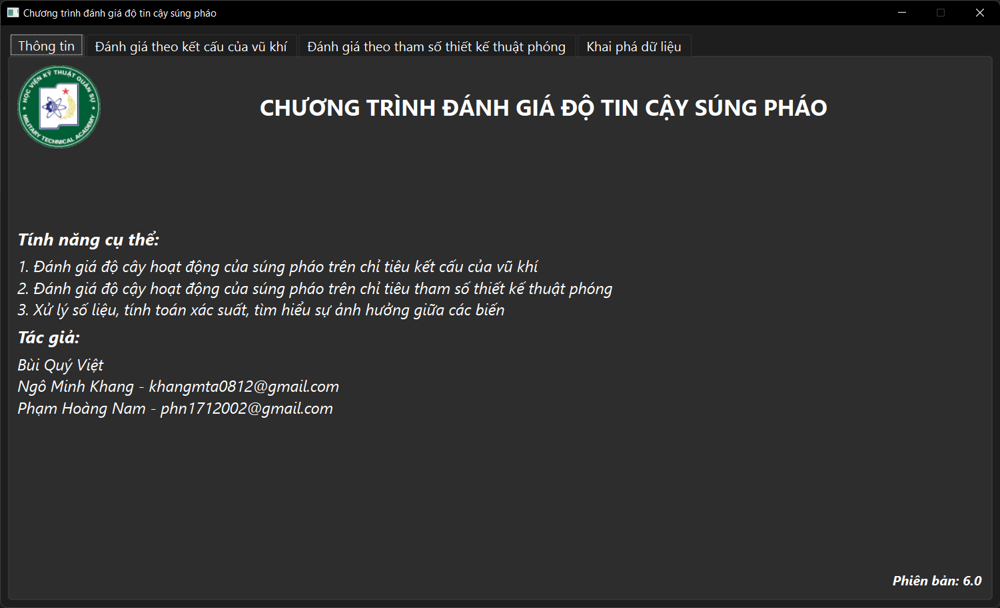
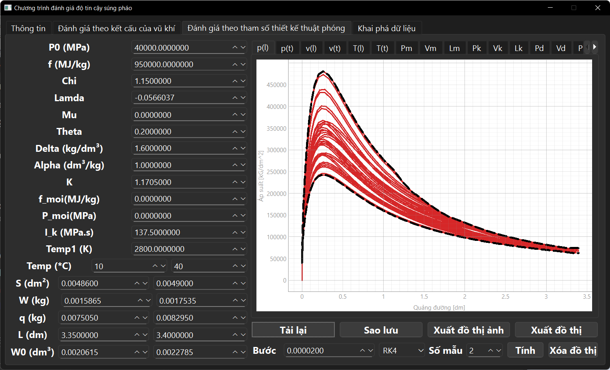

# Chương trình đánh giá độ tin cậy của súng bộ binh

### Nội dung: 
1. Đây là mã nguồn cho đồ án tốt nghiệp cuối khóa tại Học viện kỹ thuật quân sự.
   

2. Tên của đồ án tốt nghiệp "Thiết kế chương trình đánh giá độ tin cậy của súng bộ binh trong quá trình thiết kế".

   
   
   

## Liên hệ
1. Tác giả : Phạm Hoàng Nam
2. Gmail : phn1712002@gmail.com
3. Mã nguồn : https://gitlab.com/phn1712002/MTAK56_doAnTotNghiep#
